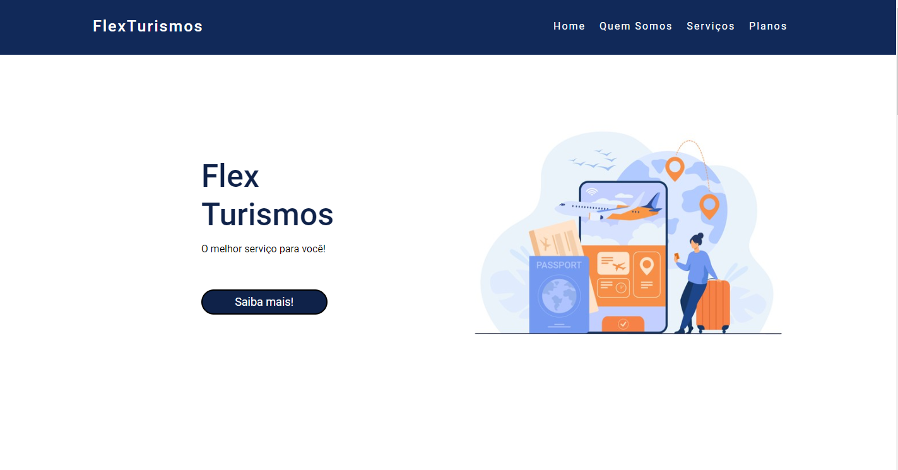
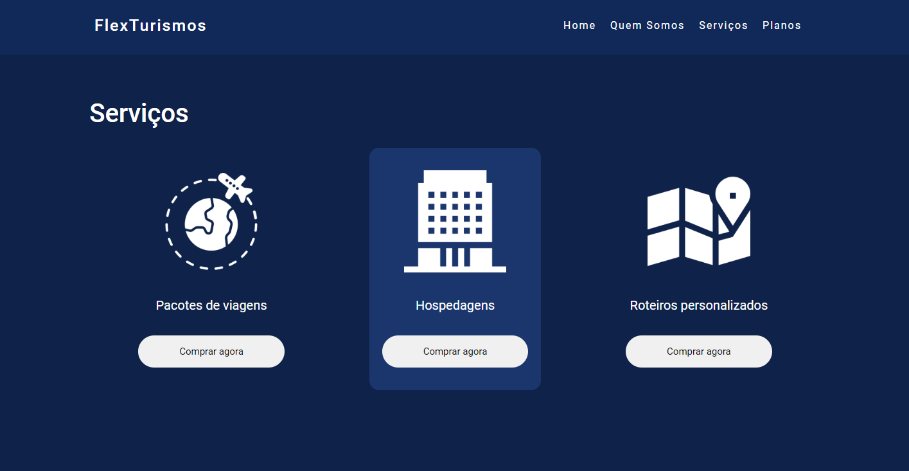
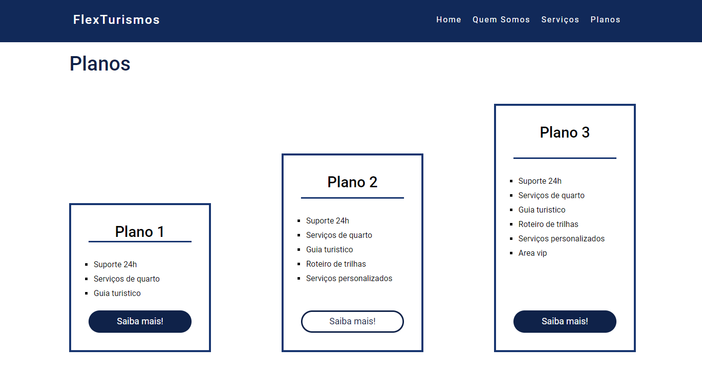

# Projeto Flex Turismo

### Olá! Seja bem vindo 👋

#### O Objetivo deste projeto é estudar o FlexBox juntamente com as propriedades relacionadas ao flex-container e os flex-items

📌 *Alguns dos atributos estudados aqui são:*

- Flexbox
- keyframes
- transform

---
#### Como testar este projeto na sua máquina?
- Basta clonar ou fazer download do projeto e clicar duas vezes sobre o arquivo index.html

:heavy_check_mark: Home
 

---
:heavy_check_mark: Serviços
 

---
:heavy_check_mark: Planos
 

---

###### *"Não confunda jamais conhecimento com sabedoria. Um o ajuda a ganhar a vida; o outro, a construir uma vida." (Sandra Carey)*

